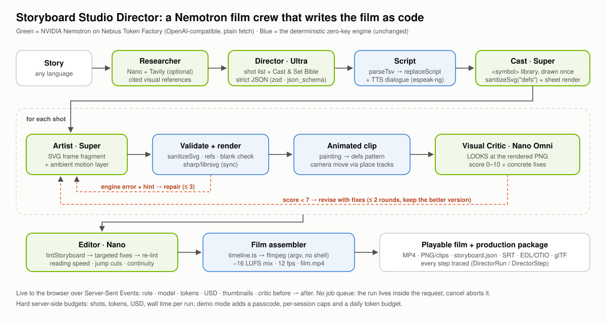
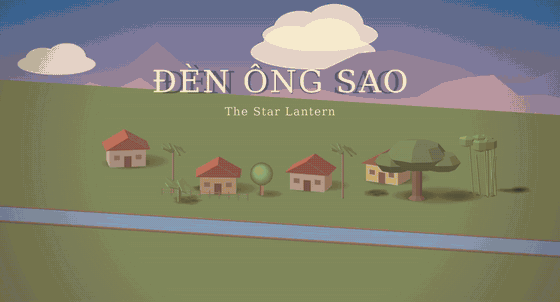
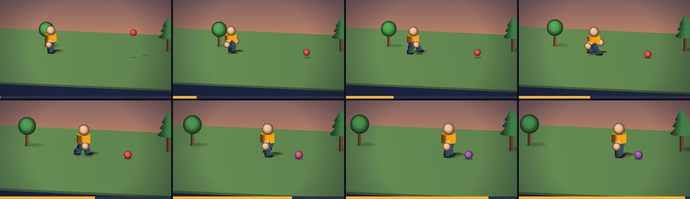
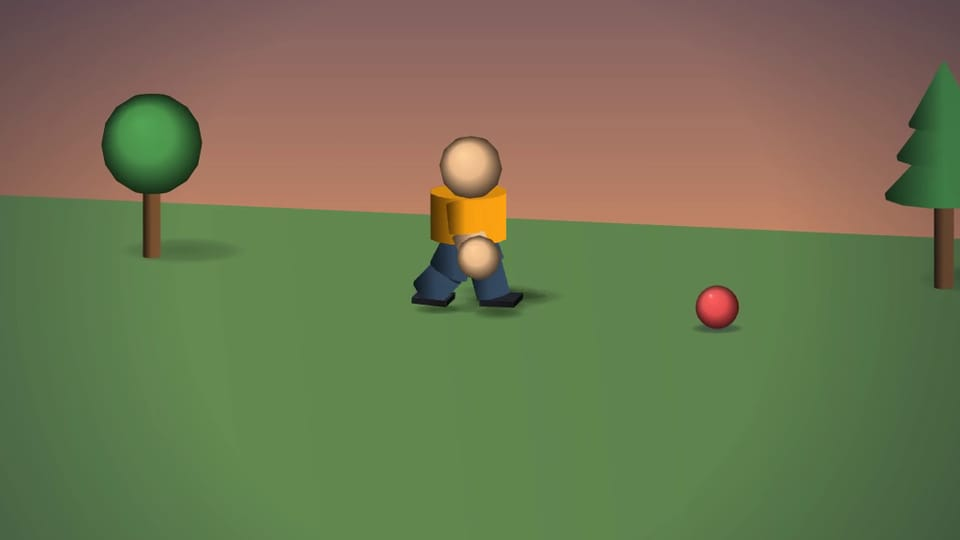
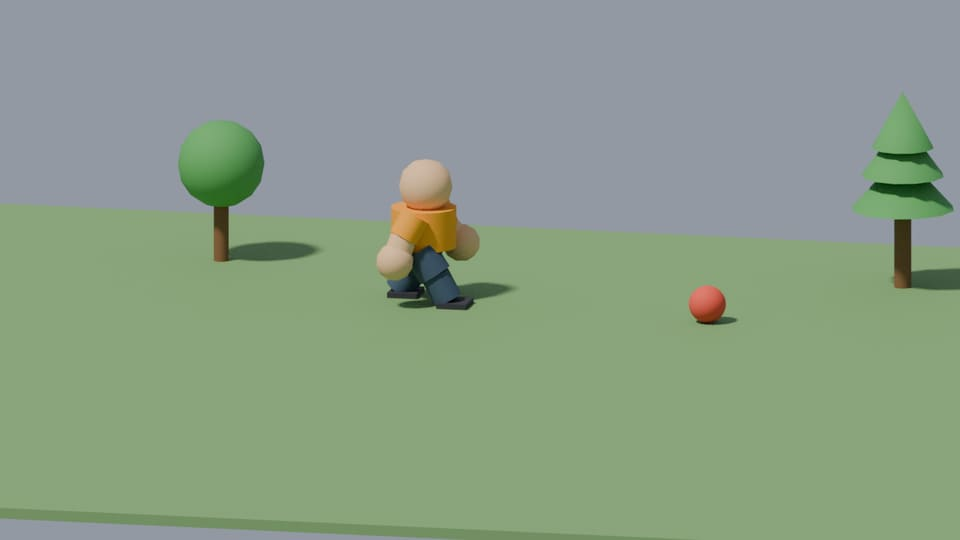

# Storyboard Studio: Director

> **Type a story. Get a film. No image generator.** A crew of **NVIDIA Nemotron** models on **Nebius Token Factory** writes the whole film *as code* (SVG, construct and motion specs) into a deterministic engine, which **measures every render**. The crew then critiques those measurements and fixes the frames.
>
> 🎬 **Live demo:** <https://studio-production-049c.up.railway.app> (passcode-protected; the passcode is in the submission's testing instructions) · 🎞 **[Showcase films](https://studio-production-049c.up.railway.app/showcase)** · 📊 **[Eval results](docs/hackathon/EVAL_RESULTS.md)** · ⚖️ **[MIT licensed](LICENSE)**

<p align="center"></p>

### How we use Nebius Token Factory + NVIDIA Nemotron

Every model call goes to Token Factory's OpenAI-compatible endpoint (`POST {NEBIUS_BASE_URL}/chat/completions`, plain `fetch`, no SDK), through one provider layer (`src/lib/providers/`). It handles strict `json_schema` output with a `json_object` fallback, image input as `image_url` data URIs, the `enable_thinking` reasoning toggle, retries with backoff and timeouts, and **per-call token and USD accounting**.

| Role | Nemotron tier | Why this tier | What it does |
|---|---|---|---|
| 🎬 **Director** | **Nemotron 3 Ultra** (`NEMOTRON_STRONG_MODEL`) | Hardest reasoning, called **once per film** | Story → shot list + Cast & Set Bible as strict JSON (zod-validated), written through the same TSV/script path a human import uses |
| 🖌️ **Artist** | **Nemotron 3 Super** (`NEMOTRON_MID_MODEL`) | Long, precise structured output, many calls | Builds the `<symbol>` cast library once (pixel-identical characters in every shot). Human characters are specified for the engine's parametric character kit; animals, sets and props are drawn as SVG, and symbols are accepted one by one, then every frame as an SVG fragment + ambient motion layer, 3 shots in parallel. Engine errors **and failed render measurements** come back with a hint → **≤ 3 repairs** |
| 📏 **Critic** | **Nemotron 3 Nano** (`NEMOTRON_FAST_MODEL`) + the engine's render gates | Cheap, fast, and grounded in pixels it cannot see | The engine measures each render (visible character height per shot type, night brightness, set coverage). Nano reads those measurements plus the SVG, scores the frame 0–10 against the shot and lists concrete fixes. **≤ 2 revision rounds**, and a revision is kept only if it scores higher. When Token Factory serves an image-input model, `NEMOTRON_VISION_MODEL` switches the same loop to send the image |
| ✂️ **Editor** | **Nemotron Nano** (`NEMOTRON_FAST_MODEL`) | Fast everyday calls | Fixes `lintStoryboard` findings (reading speed, jump cuts, voice timing) and runs a continuity check |
| 🔎 **Researcher** | Nano + **Tavily** | Grounding | Optional capped search/extract → cited visual reference notes in the Bible and the UI |

The **measure-and-revise loop** is the core idea. LLMs don't paint pixels here: they write code, the engine renders it deterministically and **measures the pixels**, and the numbers drive repairs and critique. Token Factory lists no image-input Nemotron today (Nano and Super answer `400 "does not support image input"`, see [evidence](docs/hackathon/evidence/vision-probe-2026-09-26.json)), so the critic is Nano in text mode by design. The trace says so, and the UI chip shows "📏 Nano critic". Costs and tokens are logged per step and shown live in the UI. Measured numbers (first-pass render rate, repairs per shot, critic uplift, USD per finished minute) are in **[EVAL_RESULTS.md](docs/hackathon/EVAL_RESULTS.md)**, which comes from real runs only.

**Try it**
1. Open the demo, enter the passcode, type a story (any language), pick a style, then **Make my film**.
2. Watch the crew timeline stream in: role, model, tokens, cost, thumbnails, critic before → after.
3. Play the film, then download the **MP4** or the full **production package** (PNG, clips, SRT, EDL/OTIO, glTF, `assemble.sh`).

**Run it yourself**
```bash
npm install && cp .env.example .env && npx prisma migrate deploy
echo 'NEBIUS_API_KEY=…' >> .env.local        # optional: without it the zero-key engine works as before
npm run director:models                      # verify model ids against GET /v1/models
npm run dev                                  # http://localhost:3000
```
`LLM_PROVIDER=mock` runs a scripted crew with no key and no network (tests, UI demos). Deploy with the `Dockerfile` (ffmpeg + espeak-ng, migrations on boot, volume at `/data`); set secrets as platform variables. Design notes: [ADR-017](docs/ADR.md). Build log and honest status: [docs/hackathon/](docs/hackathon/STATUS.md).

---

## The engine underneath (zero-key)

<p align="center">
  <a href="docs/media/den-ong-sao-720p.mp4"></a><br>
  <b>This is a real 20-minute 3D animated film, made entirely by an agent with this repo.</b><br>
  <b>Đây là một bộ phim hoạt hình 3D dài 20 phút, do agent làm hoàn toàn bằng repo này.</b><br>
  <a href="docs/media/den-ong-sao-720p.mp4">▶ Watch the full film · Xem phim đầy đủ (20:14, 720p, 40 MB)</a> ·
  <a href="docs/media/den-ong-sao-trailer.mp4">1-minute trailer</a> ·
  <a href="examples/film/">how it was made</a>
</p>

**A zero-API-key storyboard engine for AI agents** — the [Remotion](https://www.remotion.dev/) model applied to storyboard images. Your coding agent (Claude Code, Codex, …) **writes each frame's artwork as SVG code**; this engine sanitizes, renders (via [sharp](https://sharp.pixelplumbing.com/)/librsvg), watermarks, previews, and packages everything for video assembly. No image-generation API. No keys. No credits. Deterministic output.

**Character consistency is guaranteed by construction**: the agent defines the mascot ONCE as an SVG `<symbol>` in the project's artwork library — every frame reuses it with `<use href="#id">`, so the character is pixel-identical across the entire storyboard.

**Now with a time dimension**: any frame can be an animated shot (keyframe tracks + procedural rigs such as a no-slip walk cycle and storyboard camera moves). The export builds `film.mp4` with one command and ships every shot as **glTF 2.0** for path-traced rendering in Blender: script → storyboard → animatic → 3D film pipeline, still with zero API keys.

> 🇻🇳 Có phần **Tóm tắt tiếng Việt** ở cuối file.

## 🎬 Proof: a 20-minute animated film made with this engine

<p align="center"></p>

**[Đèn Ông Sao · The Star Lantern](examples/film/)** — 20:14, 105 shots, 7 chapters, DCI Flat 1998×1080 at 24 fps, narration + dialogue with lip-sync, an original score, mastered as a theatrical SMPTE DCP (13.2 GB, ClairMeta: 78 checks passed; asdcplib + SMPTE XSDs verified). Written, staged, animated, voiced, scored and edited by an agent **through this app's own API** (`examples/film/produce.ts` only calls public endpoints), with no hand-drawn frame and no API key. The screenplay → motion specs step is deterministic and test-enforced (`tests/film.test.ts`).

[▶ full film (20:14, 720p)](docs/media/den-ong-sao-720p.mp4) · [1-minute trailer](docs/media/den-ong-sao-trailer.mp4) · [one frame every 40 s](docs/media/den-ong-sao-contact-sheet.jpg) · [source + how to reproduce](examples/film/README.md)

## How it works

```
script (TSV / Google Sheet)          agent writes SVG          engine renders
┌─────────────────────────┐   ┌───────────────────────┐   ┌──────────────────┐
│ 1  Wide shot   Pip waves│ → │ defs: <symbol id=pip> │ → │ F01.png … FNN.png│ → Remotion
│ 2  Close-up    Pip smile│   │ frame: <use href=#pip>│   │ + storyboard.json│   (agent-built
│ 3  Wide shot   Night    │   │        + scenery      │   │ + captions.srt   │    video, $0)
└─────────────────────────┘   └───────────────────────┘   └──────────────────┘
```

Everything is a REST API (a full web UI is included for humans). The whole loop runs locally and free — the only optional external service is Google Sheets as a script source.

## Quickstart

Requires Node.js 20+.

```bash
npm install                # runs prisma generate via postinstall
cp .env.example .env       # defaults work out of the box — nothing to fill in
npx prisma migrate deploy  # create the SQLite database
npm run dev                # http://localhost:3000
```

Checks: `npm test` · `npm run build` · `npm run lint`.

## Agent workflow

A complete run, start to finish ([examples/](examples/) contains the working sample below):

```bash
BASE=http://localhost:3000

# 1. Project
PID=$(curl -s -X POST $BASE/api/projects -H "Content-Type: application/json" \
  -d '{"name":"My spot"}' | jq -r .id)

# 2. Script — TSV rows: STT | Shot Type | Description (header optional)
curl -s -X POST $BASE/api/script/import -H "Content-Type: application/json" \
  -d "{\"projectId\":\"$PID\",\"source\":\"tsv\",\"tsvText\":\"1\tWide shot\tPip waves hello\n2\tClose-up\tPip smiles\"}"

# 3. Artwork library — define your character ONCE (symbols, gradients, props)
jq -Rs "{artworkDefs: .}" examples/defs.svg | \
  curl -s -X PATCH $BASE/api/projects/$PID -H "Content-Type: application/json" -d @-

# 4. Per-frame artwork — scene body referencing the library (sync render, ~50ms)
jq -Rs "{svg: .}" examples/frame-01.svg | \
  curl -s -X PUT $BASE/api/frames/<frameId>/artwork -H "Content-Type: application/json" -d @-

# 5. Iterate — tweak the library, re-render every frame in one call
curl -s -X POST $BASE/api/render -H "Content-Type: application/json" -d "{\"projectId\":\"$PID\"}"

# 6. Export: F01.png…FNN.png + storyboard.json + captions.srt
curl -s "$BASE/api/export/zip?projectId=$PID" -o storyboard.zip
```

### The artwork contract

- **Logical canvas** (`viewBox` you draw in) is fixed per aspect ratio; output PNG long edge = 1024 (1K) / 2048 (2K) / 4096 (4K). The two cinema ratios render the **exact DCI container** instead (1K = half-size preview):

  | Ratio | Logical canvas | 1K output | 2K output | 4K output |
  |---|---|---|---|---|
  | 16:9 | 1920×1080 | 1024×576 | 2048×1152 | 4096×2304 |
  | 9:16 | 1080×1920 | 576×1024 | 1152×2048 | 2304×4096 |
  | 1:1 | 1080×1080 | 1024×1024 | 2048×2048 | 4096×4096 |
  | 4:5 | 1080×1350 | 819×1024 | 1638×2048 | 3277×4096 |
  | **1.85:1** (DCI Flat) | 1998×1080 | 999×540 | **1998×1080** | **3996×2160** |
  | **2.39:1** (DCI Scope) | 2048×858 | 1024×429 | **2048×858** | **4096×1716** |

- Submit **SVG fragments** — the engine owns the `<svg>` wrapper. `artworkDefs` is the inner content of `<defs>`; frame SVG is the scene body.
- Allowed references: `href="#id"`, `fill="url(#id)"`, `data:image/png|jpeg|webp` data-URIs. Everything external (http, file, relative paths) is rejected with `422 ARTWORK_INVALID` + a hint. Also rejected: DOCTYPE/entities, `<script>`, `<foreignObject>`, event handlers, `@import`, `xml:base`, processing instructions, nested `<svg>` roots (even inside comments — the sanitizer rejects over-broadly by design), fragments over 500KB (UTF-8 bytes).
- **Prefer paths/shapes over `<text>`** — text renders but font metrics differ across operating systems; paths are pixel-identical everywhere.
- A failed render still saves your SVG (`status: "failed"` + `errorMsg`) — agent work is never lost.

## Geometric construction API (3D & complex vector art)

Hand-writing every `<path>` is the hard way. `POST /api/construct` gives you the **geometric construction method** human vector artists use: decompose into primitive shapes, **combine** (boolean union/difference/intersection/exclusion), **transform** (affine, 3D rotation, extrusion), then shade — compiled deterministically to SVG paths.

```bash
curl -s -X POST $BASE/api/construct -H "Content-Type: application/json" -d '{
  "spec": {
    "version": 1,
    "shapes": [
      {"id": "disc",  "type": "circle", "r": 220},
      {"id": "teeth", "type": "star", "points": 12, "rOuter": 262, "rInner": 214},
      {"id": "body",  "type": "boolean", "op": "union", "of": ["disc", "teeth"]},
      {"id": "hub",   "type": "circle", "r": 80},
      {"id": "gear",  "type": "boolean", "op": "difference", "of": ["body", "hub"], "fill": "#F4B23C"}
    ]
  },
  "preview": {"background": "#1a1a2e"}
}'
# → { "svg": "<g …>", "stats": {…}, "warnings": [], "previewPng": "data:image/png;base64,…" }
```

**Stateless by design**: nothing is stored — look at `previewPng`, iterate on the spec (~20ms/compile), then paste `svg` into `artworkDefs` (as part of a `<symbol>`) or a frame body. The SVG you save stays the single source of truth.

The spec vocabulary:

| Field | What you get |
|---|---|
| `shapes[]` | 2D: `rect(w,h,rx)` · `circle` · `ellipse` · `polygon` · `regularPolygon` · `star` · `line` · raw `path` · `boolean{op, of:[ids]}` — every shape takes `at/rotate/scale/skew/mirror/fill/stroke`. Booleans run on real bezier curves (via [path-bool](https://github.com/r-flash/PathBool.js)), and nest freely. |
| `solids[]` | 3D: `box` · `cylinder` · `cone(rTop)` · `sphere` · `prism` · `pyramid` · `extrude{profile: 2D-shape-id, depth}` · **`csg{op: union\|difference\|intersection, of:[solid-ids]}`** — real **volumetric CSG**: subtract a sphere from a box, drill a cylinder through anything, nest csg in csg. Cut faces inherit the cutter's color (a drilled hole shows red if the drill was red); `csg.fill` overrides. `shading`: `auto` · `faceted` · `smooth` (silhouette + gradient) · `none`. Per-solid `shadow:false` opts out of the shadow layer, `group` attaches to an FK frame. |
| `groups[]` | **Forward-kinematics frames**: `{id, parent?, at, rotate, scale}` — parent-before-child chains; any solid or part with `group` composes through the chain (rotate a parent, everything attached follows). |
| `parts[]` | **Parametric parts**: `figure` (articulated character — `height`, `headCount` 2-8 from realistic to chibi, `pose` by joint name in degrees: `{"elbowL": -90, "spine": [22,0,0]}`, A-pose neutral) · `wheel` (tire/hub/bore/spokes) · `tree` (blob/cone/layered) · `cloud` · `arrow`. Expand to solids named `partId:segment` — targetable by csg/cutouts. |
| `camera` | Presets `isometric` (true 35.264°) · `isometric-2:1` · `dimetric` · `top/front/side`, or **free orbit** `{azimuth, elevation, roll}`; `orthographic` or `perspective` (auto-fit distance); `zoom`. |
| `light` | One directional light; `mode`: `quantized` (`tones: 2-8`, default 3 — classic flat-design) · `smooth` · **`gradient`** (per-face smooth ramps along the light axis, `userSpaceOnUse`). |
| `shadow` | Ground-shadow layer: `style: silhouette` (exact projected outline — a washer casts a ring) · `blob` (soft radial ellipse) · `long` (stylized 45° sweep); `opacity`, `ground` plane height, optional `blur` (feGaussianBlur). Draws over floor solids, under everything above. |
| `depthSort` | **`exact`** (default): Newell–Newell–Sancha ordering — **interpenetrating solids render correctly** (faces split lazily only at true conflicts; clean scenes are byte-identical to painter). `painter`: legacy centroid sort, faster, may mis-order intersections. |
| `cutouts[]` | Post-projection booleans on a face: `subtract` (punch through a flat face) or `overlay` (decal clipped to the face — doors, windows, labels). |
| `gradients[]` | **Author gradients**: `linear{angle°}` / `radial{focus, radius}`, 2-16 stops with per-stop `opacity` — reference anywhere via `fill:"url(#id)"`, resolved inside the fragment (previews render them). |
| solid `effects` | **Softness layers per solid** (see The Softness Principle below): `formShadow` · `highlight` · `rim` · `coreAccent` · `specular` · `glow{halo\|blur}` · `contact` — each `true` for defaults or an object to tune. Parts accept the same `effects` as a passthrough. |
| `atmosphere` | Scene-wide softness: `depthFade{color,strength,desaturate}` (aerial perspective) + `vignette{color,strength,start,size}` (drawn last, canvas-exact under any `place`). |
| `finish` | One-touch preset: `flat` (default) · `soft` (formShadow+highlight+contact everywhere) · `premium` (+rim, +specular on smooth solids, +light vignette). Only fills solids without their own `effects`; `"effects": {}` opts out. |
| `place` | Position/scale/rotate the result on the logical canvas (default center 16:9). 2D shapes take `layer:"foreground"` to draw over the 3D scene. |

Coordinates: 2D is y-down (SVG convention); the 3D world is y-up right-handed, heights along y. Face labels for cutouts: `top/bottom/front(+z)/back/left/right(+x)` on box/extrude. Figure joints: `spine, neck, shoulderL/R, elbowL/R, wristL/R, hipL/R, kneeL/R, ankleL/R` (scalar pose value = z-axis bend; limbs hang along −y, so e.g. `elbowL: [-90,0,0]` points the forearm forward).

Working examples with their exact compiled output: [construct-gear.json](examples/construct-gear.json) (2D booleans) · [construct-house.json](examples/construct-house.json) (isometric + extrude + cutouts) · [construct-rocket.json](examples/construct-rocket.json) (free camera + smooth shading) · [construct-dice.json](examples/construct-dice.json) (volumetric CSG pips) · [construct-cart.json](examples/construct-cart.json) (**the works**: posed figure pushing a hollowed cart on wheel parts, with shadows) · [construct-shading.json](examples/construct-shading.json) (gradient mode + blob shadows) · [construct-lamp.json](examples/construct-lamp.json) (**softness hero**: night street lamp — glow, halos, rim light, depth fade, mist, vignette).

Every response includes `stats` (`facesGenerated/bytes/compileMs/csgOps/depthSplits/partsExpanded/effectPaths/filters`) so you can tune against the limits (256 nodes post-expansion, 5,000 faces, 8 csg ops × 2,000 input faces, 96 effect paths, 6 blur filters, 400KB output, 2s compile). Spec errors return `422 CONSTRUCTION_INVALID` with an actionable hint (`Did you mean "hole"?`). Honest limitations (ADR-011/012/013): CSG is epsilon-based BSP (near-tangent/coplanar operands may need a small nudge — the hint tells you); `exact` depth-sort falls back to painter order past 2,000 splits (warned); smooth solids in `exact` mode insert by depth (approximation); effects are per-solid screen overlays (interpenetrating solids get a warning). The reserved gradient id prefix is `cg-`.

### The Softness Principle (making vector art feel soft)

Vector art is **hard-edged by nature** — a vector shadow is just another shape with a crisp boundary, while real 3D shading falls off smoothly from light to dark. Every "soft" vector illustration you've admired fakes that softness the same way: **stack hard shapes, feather their edges with gradients (cheap) or blur (expensive), and let color do the heavy lifting**. This engine compiles the whole principle for you — and it's worth understanding, because composing the layers well is what turns primitive blocks into finished artwork.

**One boolean rule generates the core light layers.** Take a solid's screen silhouette `S`, the light's screen direction `L`, and `R` = half the short side of `S`'s bounding box. Shift a copy of `S` toward the light and combine:

| `effects.…` | Geometry | Reads as |
|---|---|---|
| `formShadow` | `S − shift(S, 0.45R)` | soft dark crescent on the side away from the light |
| `highlight` | `S ∩ shift(S, 0.5R)` | gentle bright wash on the lit side |
| `coreAccent` | `(S − shift(to·R)) ∩ shift(from·R)` | darkest band just inside the shadow edge |
| `specular` | disc at centroid − `L`·0.6R, ∩ `S` | glossy hot-spot (spheres, metal, glass) |
| `rim` | `S − shift(S, width·R)` | thin bright back-edge (backlight/moonlight) |
| `glow` | halo disc **behind** the solid, or blurred copy of `S` | the object emits light |
| `contact` | gradient ellipse on the ground under the solid | grounding/ambient occlusion — no filter |

The soft edge needs **no filter at all**: each crescent is filled with a `userSpaceOnUse` linear gradient running along `L` whose stop-opacity fades to 0 at the terminator. That's the whole trick.

**Color discipline is baked into the defaults.** Shadows are never `#000` — the default shadow tint is the base color with lightness −25% and hue rotated ~25° toward cool (230°, night blue). Highlights are warm (`#fff1dd`), rims cool (`#dcecff`), and every parameter (`color/opacity/shift/width`) is overridable per effect. Keep one shadow hue per scene; typical opacities: formShadow 10–20%, highlight 8–15%, contact ~45%.

**Respect the filter budget.** Blur is the *only* expensive tool — max **6 filters per fragment** (`shadow.blur` + `glow.mode:"blur"`). Everything else is gradients, which cost nothing: use `glow.mode:"halo"` for most glows, `contact` instead of blurred drop-shadows, and plain 2D circles filled with your own `gradients[]` for big ambient halos (see how the lamp example fakes its street-light pool of light).

**Declare your own gradients** in `gradients[]` and reference them anywhere with `fill:"url(#id)"` — `linear{angle}` (degrees: 0 = →, 90 = ↓) or `radial{focus, radius}`, 2–16 stops with per-stop opacity. They resolve inside the fragment, so `previewPng` shows them correctly.

**Scene-level softness** lives in `atmosphere`: `depthFade` pushes far solids toward a sky color (+desaturation) for aerial perspective; `vignette` darkens the frame corners (drawn last, always covering the canvas even under `place` rotation). Set `layer:"foreground"` on any 2D shape to draw it **over** the 3D scene (mist bands, haze) — foreground sits above solids, below the vignette.

**One-touch presets**: `finish:"soft"` gives every solid `formShadow + highlight + contact`; `finish:"premium"` adds `rim`, `specular` on smooth solids, and a light vignette. Presets only fill solids that don't declare `effects` themselves — set `"effects": {}` to opt a solid out, or declare your own to take control. Parts (`figure`/`wheel`/`tree`) accept an `effects` passthrough applied to every solid they generate.

Layer order per scene (what the engine draws, back to front): background 2D → ground solids → projected shadows → contact shadows → solids far-to-near (each: glow behind → faces → crescents on top) → foreground 2D → vignette.

The full showcase is [construct-lamp.json](examples/construct-lamp.json) — a night street-lamp scene: author gradients for the sky and two *free* halos, one blur spent on the bulb, a figure rim-lit in moonlight cool, trees receding through `depthFade`, a foreground mist band, and a vignette.

## Motion — the time dimension (construct v4)

A storyboard frame can now be **a shot that moves**. A motion spec is one shot: a base construct scene + keyframe **tracks** + procedural **rigs**, sampled at `fps`; every frame is a full, deterministic construct compile (so everything above — CSG, FK figures, softness — animates for free).

```bash
curl -s -X POST $BASE/api/motion -H "Content-Type: application/json" -d '{
  "motion": {
    "version": 1, "fps": 12, "duration": 3,
    "scene": { "version": 1,
      "solids": [{"id": "ball", "type": "sphere", "r": 34, "at": [360, 34, 140], "fill": "#e74c3c"}],
      "parts":  [{"id": "pip", "type": "figure", "height": 300, "headCount": 3}],
      "camera": {"orbit": {"azimuth": 12, "elevation": 12}} },
    "rigs":   [{"type": "walk", "part": "pip", "path": [[-520, 60], [180, 60]]},
               {"type": "shot", "move": "dollyIn", "amount": 0.25}],
    "tracks": [{"target": "solids.ball.at.1", "keys": [{"t": 0, "v": 260}, {"t": 1.2, "v": 34, "ease": "outBounce"}]}]
  },
  "preview": {"sheetFrames": 12, "webp": true}
}'
# → { stats, warnings, posterPng, contactSheetPng, clipWebp }
```

**Look at `contactSheetPng`** — a grid of evenly sampled frames with a time bar under each tile: that is how an agent *sees* motion in one image. Then `PUT /api/frames/:id/motion {motion}` makes that storyboard frame an animated shot (full-res PNG sequence + animated WebP; the `poster` frame becomes the frame's still, so watermark/grid/export keep working).

| Field | What you get |
|---|---|
| `fps` · `duration` · `holdFrames` | 12 fps = the animation standard; `holdFrames: 2` = **animate on twos** (each pose held 2 frames; camera/place stay on ones so pans don't judder). ≤ 240 frames per shot. |
| `tracks[]` | `{target, keys:[{t, v, ease}], blend}` — `target` is a dotted path by id: `camera.orbit.azimuth` · `camera.zoom` · `place.at.0` · `light.direction` · `solids.ball.at.1` · `solids.ball.fill` · `parts.pip.pose.kneeL` · `groups.arm.rotate.2` · `gradients.sky.stops.0.color` · `atmosphere.vignette.strength`. Values are numbers, vectors (index a component with `.0/.1/.2`) or `#hex` colors (mixed in linear light). `blend: "add"` layers on top of the base value. |
| `ease` | Applies to the segment **arriving** at the key. `inOut` (default — slow-in/slow-out) · `linear` · `step` (hold) · `in` · `out` · `inBack`/`outBack` (anticipation/overshoot) · `outElastic` · `outBounce` · `smooth` (Catmull-Rom through multi-key paths, no stops) · CSS `[x1,y1,x2,y2]`. |
| rig `walk` | `{part, path:[[x,z]…], start?, end?, swing?, armSwing, bounce, lean, cadence}` — a figure walks a ground polyline. Stance is 60 % of the cycle and the hip angle is **solved** so the ankle retreats exactly at body speed: **the planted foot does not slide** (test-enforced < 3 %). Hip height is exact (lowest foot touches the ground); arms counter-swing; stride auto-derives from speed at ~2 steps/s. |
| rig `shot` | Camera language: `dollyIn` · `dollyOut` · `orbit` · `crane` · `pan` · `tilt` · `shake` · `static` · **`auto`** (inferred from the storyboard Shot Type, EN + VI: "Slow zoom-in" → dollyIn, "Lia máy" → pan…). |
| rig `roll` | Rolling without slipping: rotation = distance / radius, from the target's (or `follow`'s) motion. |
| rig `follow` | Follow-through / overlap: target repeats a source's motion `lag` seconds late × `gain` (head lags the body, tails, antennas, a camera that trails the hero). |
| rig `wiggle` | Seeded smooth noise (fBm) added to any value — handheld camera, breathing, idle sway. Deterministic: same seed, same frames. |
| `backdrop` · `overlay` · `background` · `poster` | Static SVG under/over the scene each frame (may `<use href="#…">` the project library), full-bleed color, and the storyboard still's time. |

Evaluation order is fixed: generators (`walk`, `shot`) → `tracks` → dependents (`roll`, `follow`) → `wiggle`; the scene is re-validated every frame, so a track that drives a radius negative fails with the exact time (`At t=0.5s … solids.0.r`). Identical frames (holds, static shots) compile once. Examples: [motion-stroll.json](examples/motion-stroll.json) (walk + camera follow + bounce) · [motion-bounce.json](examples/motion-bounce.json) (squash & stretch on twos).

<p align="center"></p>

## 3D export — glTF 2.0 (the bridge to real renderers)

`POST /api/export/gltf` with `{spec}` (a static scene) or `{motion}` (a shot) returns **glTF 2.0** (JSON + embedded buffer): one node per solid — including every figure segment (`pip:shinL`) — with the **same meshes the SVG renderer draws**, materials from your fills (or `unlit`), a camera framed exactly like the SVG frame (test-enforced: a world point lands on the same canvas pixel), a sun light, and the shot's animation as TRS samplers (`STEP` when on twos). Validated by the Khronos glTF-Validator in CI (0 errors). The export ZIP includes `gltf/FNN.gltf` for every motion shot.

```bash
jq '{motion: ., download: true}' examples/motion-stroll.json | \
  curl -s -X POST $BASE/api/export/gltf -H "Content-Type: application/json" -d @- -o stroll.gltf
blender -b -P scripts/blender_render.py -- stroll.gltf out/stroll_ --engine CYCLES --samples 32   # path-traced frames
```

<p align="center"> <br><sub>The same agent-authored scene: vector render (left) and Blender Cycles via the glTF export (right).</sub></p>

Honest limits: glTF core cannot animate lens parameters (zoom/fov animation is exported at its t=0 value, warned); animated *geometry* (e.g. a radius track) is baked at t=0 (transforms animate, meshes don't); 2D shapes and softness overlays are SVG-only. The long-range plan to feature-quality output is in [docs/FILM-ROADMAP.md](docs/FILM-ROADMAP.md).

## The film pipeline — rig → passes → sound → edit → DCP

Everything below is deterministic and runs locally with open tools (ffmpeg, OpenJPEG, optional espeak-ng). Each stage is verified against the reference implementation of its standard — see [docs/ADR.md](docs/ADR.md) ADR-016.

### 1 · Rig, IK and faces

The `figure` part has a named **joint hierarchy** (`hips → spine → neck`, `spine → shoulderL → elbowL → wristL`, `hips → hipL → kneeL → ankleL`, mirrored R; pose any of them via `pose` or a track on `parts.pip.pose.<joint>`) and an optional **face** (`"face": {}` → eyes + mouth drawn as `decalOf` surface features: they stick to the head, sort with it, and hide when the head turns away).

| Rig | What it does |
|---|---|
| `ik` | `{part, limb: armL\|armR\|legL\|legR, target: [x,y,z] \| {solid, offset}, pole?, weight, fade, start?, end?}` — **analytic 2-bone IK** (exact to 1e-6): put a hand on a door handle, a foot on a stair, or *track a moving solid* (`{"solid": "cart"}`); the ankle keeps the foot flat. |
| `lipsync` | `{part, gain}` — drives `face.mouthOpen/mouthWide` from the frame's dialogue audio (RMS + zero-crossing visemes), or from the text's syllables when there is no audio. Blinks are a track on `parts.pip.face.blink`. |

In glTF every figure exports as a **real skinned Armature** (one skinned mesh, one bone per joint, inverse bind matrices, TRS animation), so Blender/Unreal receive a character they can re-pose.

### 2 · Control passes for AI video

`POST /api/frames/:id/passes {"passes": ["depth", "segmentation", "normal", "pose"]}` renders a shot's conditioning maps with the **same geometry and camera** as the beauty pass: exact per-face **depth** ramps (near = bright), per-object **segmentation** colours (stable hash of the id), view-space **normals**, and **OpenPose COCO-18** skeletons straight from the FK joints (+ `pose.json`). Feed them to ControlNet / VACE / Wan to restyle the animatic while keeping the layout and acting you authored. `preview.passes` on `POST /api/motion` returns them statelessly; the export ZIP carries `passes/FNN/`.

### 3 · Dialogue, voice and the mix

- `PUT /api/frames/:id/dialogue {text, wav?, tts?: {voice: "vi", speed}, offset}` — the text becomes the subtitle; the voice is your WAV (base64) or **local TTS** (espeak-ng, no API key, spawned without a shell). A shot with a `lipsync` rig re-renders so the mouth follows the new line.
- `PUT /api/projects/:id/soundtrack {wav}` — music bed.
- Export writes `audio/FNN.wav`, `audio/music.wav` and **`audio/mix.wav`**: dialogue on the timeline, music −6 dB with **sidechain ducking** under speech (80 ms down / 350 ms up), normalized to **−16 LUFS** (BS.1770-4, matches ffmpeg `ebur128`) through a lookahead true-peak limiter. `subtitles.srt` is timed to the voice; `assemble.sh` muxes the mix as AAC.

### 4 · Scenes, transitions and the edit

`PATCH /api/frames/:id {scene, transition, transitionDuration}` — group shots into scenes; transitions `cut · dissolve · fadeBlack · fadeWhite · wipeLeft/Right · slideLeft/Right`. The timeline is **frame-quantized at 24 fps** (no drift between picture, SRT and EDL; transitions overlap the previous shot and are clamped to half the shorter neighbour). The export adds **`edit/film.edl`** (CMX3600) and **`edit/film.otio`** (OpenTimelineIO — validated with the ASWF `opentimelineio` library and its `cmx_3600` adapter), so the cut opens in DaVinci Resolve / Premiere / Avid. `GET /api/projects/:id/lint` is a continuity check (`NO_ARTWORK`, `SHOT_TOO_SHORT`, `READING_SPEED`, `VOICE_OVERRUN`, `JUMP_CUT`, …) with a hint per issue.

### 5 · Theatrical DCP mastering

Author the project on a cinema canvas — **`1.85:1`** (DCI Flat, logical 1998×1080) or **`2.39:1`** (DCI Scope, 2048×858) at `2K` (exact container) or `4K` (3996×2160 / 4096×1716) — then:

```bash
unzip storyboard-export.zip -d film && npm run master:dcp -- film --out DCP --title "Pip Goes to School" \
  --kind short --lang VI-EN --territory VN --studio PIP --facility SBS      # [--container scope] [--4k]
python -m clairmeta.cli check -type dcp DCP      # → 78 checks, 0 warnings
```

`master:dcp` builds an unencrypted **SMPTE DCP** (ST 428/429 — not the legacy Interop flavour): picture assembled with the same transitions as the timeline → **X′Y′Z′ 12-bit** (sRGB → XYZ D65, 48 cd/m² white, γ 2.6) → **JPEG 2000** (`opj_compress -cinema2K/-cinema4K 24`, parallel; `--mbps 80` keeps the same 2K cinema coding parameters but a lower rate than the 250 Mbit/s cap — a 20-minute film at the cap is ~24 GB of picture, at 80 Mbit/s ≤ 12 GB) → **MXF OP-Atom** written by a pure-TypeScript muxer; the mix streamed into L/R of a **5.1 PCM 24-bit 48 kHz** MXF and brought to cinema level (**−24 LUFS**, ≤ −1 dBTP; `--cinema-lufs off` to keep the web master); **CPL / PKL / ASSETMAP / VOLINDEX** with SHA-1 hashes and a 12-field ISDCF name (`PipGoestoSchoo_SHR_F_VI-EN_VN_51_2K_PIP_20260924_SBS_SMPTE_OV`). Needs `ffmpeg` and `opj_compress` (`apt install ffmpeg libopenjp2-tools`).

Verified: asdcplib's `asdcp-info` reads both MXFs as SMPTE 429 and `asdcp-unwrap` returns every J2K frame byte-identical; CPL/PKL/ASSETMAP validate against the SMPTE XSDs; ClairMeta passes with no warnings; ffmpeg decodes it as "JPEG 2000 digital cinema 2K"; the colour round-trip is ≤ 1.6/255 max error; the same `--date` produces a **byte-identical** DCP (asset UUIDs are seeded by project + issue date, so a re-master gets new UUIDs and theatre servers never confuse versions).

<p align="center"><br><sub>A frame decoded back out of the picture MXF by ffmpeg's own X′Y′Z′ decoder (1998×1080 Flat).</sub></p>

Honest limits: no encryption/KDMs (festival and independent delivery don't need them); one reel; stereo mix placed in L/R (no upmix to C/Ls/Rs — a real 5.1 mix comes from a dub stage); no subtitles track in the DCP yet (burn them into the picture or ship `subtitles.srt` for the cinema's own system). Mastering is an offline CLI step, not an API route — it runs for minutes to hours (≈ 4 frames/s on 4 cores at 2K), which would break the synchronous-render contract.

<details>
<summary><b>Full API reference</b></summary>

| Method | Endpoint | Body / Query | Purpose |
|---|---|---|---|
| POST | `/api/projects` | `{name}` | Create project |
| GET | `/api/projects` | — | List projects (+frame counts) |
| GET | `/api/projects/:id` | — | Hydrate project + frames + assets |
| PATCH | `/api/projects/:id` | partial project | Update name/**artworkDefs**/aspectRatio/resolution/watermark settings/playbackSpeed |
| DELETE | `/api/projects/:id` | — | Delete project + files |
| POST | `/api/projects/:id/duplicate` | — | Clone script + artwork + assets (series workflow: one `/api/render` rebuilds all images) |
| POST | `/api/script/import` | `{projectId, source:"tsv"\|"sheet", tsvText?, sheetUrl?, confirmOverwrite?}` | Replace all frames; `409 CONFIRM_REQUIRED` if frames exist |
| POST | `/api/frames` | `{projectId, afterIndex?}` | Insert a frame |
| PATCH | `/api/frames/:id` | `{shotType?, description?, scene?, transition?, transitionDuration?}` | Edit script fields, scene grouping and the transition into this shot |
| **PUT** | **`/api/frames/:id/artwork`** | `{svg}` | **Set artwork + render synchronously** → returns frame with `imageUrl` (a motion frame reverts to a still) |
| **PUT** | **`/api/frames/:id/motion`** | `{motion}` | **Make the frame an animated shot** — renders PNG sequence + WebP + poster still synchronously → frame with `clipUrl`, `stats`, `warnings` |
| DELETE | `/api/frames/:id/motion` | — | Revert to a still (keeps the poster) |
| DELETE | `/api/frames/:id` | — | Delete + reindex |
| POST | `/api/frames/reorder` | `{projectId, frameId, targetIndex}` | Move a frame |
| POST | `/api/storyboard/apply-edit` | `{projectId, frames:[{index,shotType,description}]}` | Bulk-replace the whole script (agents editing scripts) |
| **POST** | **`/api/construct`** | `{spec, preview?}` | **Compile a geometric-construction spec → SVG fragment** (+ optional PNG preview data-URI); stateless |
| **POST** | **`/api/motion`** | `{motion, shotType?, preview?}` | **Compile + render a shot** → `contactSheetPng`, `posterPng`, optional `clipWebp` / per-frame `frames[].svg`; stateless |
| **POST** | **`/api/export/gltf`** | `{spec}\|{motion}, options?, download?` | **glTF 2.0** scene (animated for a motion) for Blender/three.js/Unreal |
| **POST** | **`/api/render`** | `{projectId, frameIds?}` | **Re-render all frames with artwork** (after changing defs/ratio/resolution) — motion frames re-render their clips |
| **POST** | **`/api/frames/:id/passes`** | `{passes:["depth","segmentation","normal","pose"]}` | Control passes for a motion shot (PNG sequences + OpenPose JSON) |
| **PUT** | **`/api/frames/:id/dialogue`** | `{text, wav?, tts?:{voice,speed}, offset?}` | Dialogue line: subtitle + voice (WAV or local TTS); re-renders a lipsync shot |
| DELETE | `/api/frames/:id/dialogue` | — | Remove the line + voice |
| **PUT** | **`/api/projects/:id/soundtrack`** | `{wav}` (base64) | Music bed (ducked under dialogue in the mix) |
| DELETE | `/api/projects/:id/soundtrack` | — | Remove music |
| GET | `/api/projects/:id/lint` | — | Continuity/storyboard lint: `[{frameIndex, severity, code, message, hint}]` |
| POST | `/api/assets/upload` | multipart `projectId, kind:"watermark", files[]` | Upload watermark logo (PNG/JPEG/WebP ≤8MB, magic-byte verified) |
| DELETE | `/api/assets/:id` | — | Remove watermark |
| POST | `/api/watermark/reapply` | `{projectId}` | Re-composite watermark on all rendered frames |
| GET | `/api/export/zip?projectId=` | — | ZIP: `FNN.png` + `clips/FNN/%04d.png` + `clips/FNN.webp` + `gltf/FNN.gltf` + `passes/FNN/` + `audio/{FNN,music,mix}.wav` + `edit/film.{edl,otio}` + `storyboard.json` (timeline + all SVG/motion sources) + `captions.srt` + `subtitles.srt` + `assemble.sh` → input to `npm run master:dcp` |
| GET | `/api/files/{path}` | — | Serve rendered images (HTTP Range supported) |
| GET | `/api/meta` | — | `{serviceAccountEmail, construct:{version}, motion:{version, limits}}` (feature-detect) |
| POST | `/api/maintenance/cleanup` | — | Remove orphaned files |

Errors: `{"error":{"code","message","hint?"}}`. Codes: `ARTWORK_INVALID, CONSTRUCTION_INVALID, SHEET_NOT_SHARED, SHEET_NOT_FOUND, SHEET_BAD_FORMAT, ASSET_LIMIT, ASSET_BAD_TYPE, ASSET_TOO_LARGE, CONFIRM_REQUIRED, VALIDATION, NOT_FOUND, RATE_LIMITED, INTERNAL`.
Frame `status`: `draft → done | failed`.

</details>

## From storyboard to film

The ZIP export is a complete, self-describing film package:

- `F01.png…` — the storyboard stills (motion shots contribute their poster frame).
- `clips/FNN/0001.png…` + `clips/FNN.webp` — every animated shot as a full-res PNG sequence + a quick-look WebP.
- `storyboard.json` — settings, the **timeline** (`startSec`/`durationSec` per frame: stills hold `playbackSpeed`, shots last their clip length), full SVG sources and motion specs (re-renderable anywhere).
- `captions.srt` — timed to the same timeline (subtitles never drift from picture).
- `assemble.sh` — `sh assemble.sh` builds **`film.mp4`** with ffmpeg (the timeline's transitions via `xfade`, the mix as AAC). Verified end-to-end: durations match the timeline to the frame.
- `gltf/FNN.gltf` — each shot in 3D for Blender/Unreal (see above), figures as skinned Armatures.
- `passes/FNN/` — depth / segmentation / normal / OpenPose conditioning for AI video.
- `audio/mix.wav` + `subtitles.srt` — the −16 LUFS mix and voice-timed subtitles (muxed by `assemble.sh`).
- `edit/film.edl` + `edit/film.otio` — the cut for Resolve/Premiere/Avid.
- → `npm run master:dcp -- <unzipped export>` turns the package into a theatrical **DCP** (see above).

Prefer Remotion? Use `storyboard.json` directly: `durationSec` per frame, `motion.frames` for the sequences, `shotType` for camera moves on stills.

## Environment (`.env`)

Everything is optional except the database path:

| Variable | Default | Description |
|---|---|---|
| `DATABASE_URL` | `file:./prisma/dev.db` | SQLite database |
| `STORAGE_ROOT` | `./storage` | Rendered image storage |
| `GOOGLE_SERVICE_ACCOUNT_JSON` | — | Only for reading scripts from Google Sheets (one-line service-account JSON; share the sheet with the service-account email shown in the UI) |
| `NEBIUS_API_KEY` | — | **Director only.** Nebius Token Factory key. Stays server-side. Without it the Director is disabled and the zero-key engine works as before |
| `NEBIUS_BASE_URL` | `https://api.tokenfactory.nebius.com/v1` | OpenAI-compatible endpoint |
| `NEMOTRON_STRONG_MODEL` / `_MID_` / `_FAST_` / `_VISION_` | see `src/lib/providers/index.ts` | Crew model per tier (Director = Ultra, Artist = Super, Editor + text Critic = Nano; VISION empty = auto-detect an image-input Nemotron, none listed today). Check them with `npm run director:models`. |
| `NEBIUS_PRICES_JSON` | family estimates | `{"model-id":[inUSDper1M,outUSDper1M]}` for exact cost accounting |
| `LLM_PROVIDER` | — | `mock` = scripted demo crew with no key and no network (tests, UI demos, video dry-runs). Labelled "mock" in every trace |
| `DIRECTOR_MAX_SHOTS` / `_TOKENS_PER_RUN` / `_USD_PER_RUN` / `_WALL_SECONDS` | 12 / 600000 / 1.5 / 1200 | Hard per-run caps, enforced on the server before every model call. A request can lower them but never raise them |
| `DIRECTOR_CONCURRENCY` | 3 | Shots drawn in parallel per run (1–6). Cuts wall time; cost is unchanged |
| `SPEND_ALERT_USD` | 15 | Live scripts (`director:smoke`, showcase, bench) refuse to start once the spend ledger passes this |
| `TAVILY_API_KEY` / `TAVILY_BASE_URL` | — / `https://api.tavily.com` | Optional Tavily researcher: capped search + extract, with cited reference notes added to the Bible |
| `DEMO_MODE` / `DEMO_PASSCODE` | `false` / — | Public demo: every page and API sits behind a passcode (signed HttpOnly cookie). `/showcase` and `/unlock` stay public |
| `DEMO_MAX_PROJECTS_PER_SESSION` / `DEMO_DAILY_TOKEN_BUDGET` / `DEMO_MAX_CONCURRENT_RUNS` / `DEMO_RETENTION_HOURS` | 3 / 3000000 / 2 / 24 | Demo caps. Demo projects are deleted after the retention window |

## Architecture

```
src/lib/services/svgRenderer.ts   sanitize (reject-list) + compose + render — the core
src/lib/services/artworkService.ts render→watermark→persist pipeline per frame
src/lib/services/construct/       geometric-construction compiler (pure, deterministic):
                                  geometry2d · pathBoolean (path-bool) · pathParse ·
                                  math3d · camera · geometry3d · painterSort · shading ·
                                  plane3 · csg · sceneMeshes · depthOrder · meshRepair ·
                                  shadow · faceGradient · silhouette · effects ·
                                  atmosphere · finish · partsExpand/Figure/Wheel ·
                                  emitScene · svgEmitter · gltf · compile (orchestrator)
src/lib/services/motion/          time dimension (pure): easing · interpolate ·
                                  targetPath · noise · rigs · ik · evaluate ·
                                  compileMotion · gltfMotion (skins)
src/lib/services/motionRenderer.ts clip rasterizing, animated WebP, contact sheet
src/lib/services/timeline.ts      one timing source (24 fps frame-quantized) for
                                  storyboard.json / SRT / EDL / OTIO / assemble.sh / DCP
src/lib/services/editorial.ts     CMX3600 EDL + OpenTimelineIO; storyboardLint.ts
src/lib/services/audio/           pure-TS WAV codec + resampler, BS.1770-4 loudness,
                                  mixer (ducking, limiter), lip-sync visemes; tts.ts
src/lib/services/dcp/             DCP mastering (pure): color (X′Y′Z′) · mxf (SMPTE
                                  OP-Atom muxer) · packaging (CPL/PKL/ASSETMAP) ·
                                  picture (ffmpeg graph) · uuid; scripts/master-dcp.ts
src/app/api/                      REST routes (Zod, rate-limited, error envelope)
src/components/                   Web UI (Next.js App Router + Zustand)
src/lib/services/                 tsvParser, sheetReader, watermarker (sharp), storage…
prisma/                           Project / Frame / Asset (SQLite, single migration)
tests/                            Vitest — sanitizer bypass-vector suite + construct
                                  golden/determinism/pixel-proof suites
```

- **Rendering is synchronous and local** (~20–50ms per frame warm; first render per process ~1–2s while libvips initializes) — no job queues, no polling.
- **Sanitizer soundness** (see `docs/ADR.md` ADR-010): banning `<!DOCTYPE` closes XML's only markup-construction channel, making pattern screening sound; rejected-not-stripped; librsvg itself executes no scripts and performs no I/O for buffer input; only rendered PNGs are ever served to browsers.
- **Raw renders are kept** — watermark position/scale/opacity can be re-applied any time without re-rendering.

## Security notes

- No user accounts: a **local/internal tool by design**. For a public URL, run with `DEMO_MODE=true` + `DEMO_PASSCODE` (passcode gate on every page and API route, per-session caps, 24 h cleanup, daily token budget).
- LLM keys (`NEBIUS_API_KEY`, `TAVILY_API_KEY`) live only on the server; story text and web snippets are passed to models as quoted DATA (injection guard), and every model output goes through zod + `sanitizeSvg` + the construct/motion validators before it reaches the engine.
- User-supplied SVG is sanitized (strict reject-list) and only ever rasterized server-side; uploads are magic-byte verified and UUID-renamed; file serving is traversal-guarded; all inputs Zod-validated; mutating routes rate-limited.

## License

[MIT](LICENSE)

---

## 🇻🇳 Tóm tắt tiếng Việt

**Storyboard Studio** — engine tạo ảnh storyboard **không cần API key** theo mô hình Remotion: AI agent (Claude Code, Codex…) tự **viết artwork từng frame bằng code SVG**, engine sanitize + render (sharp/librsvg) + watermark + preview + đóng gói. Không tốn một xu credit, output deterministic.

**Nhất quán nhân vật tuyệt đối theo kiến trúc**: mascot định nghĩa MỘT LẦN là `<symbol>` trong thư viện defs của project, mọi frame `<use href="#id">` → giống hệt từng pixel. Đổi thiết kế một chỗ, gọi `POST /api/render` một phát — toàn bộ storyboard cập nhật.

**Quy trình agent:** tạo project → import kịch bản TSV/Google Sheet → `PATCH artworkDefs` (thư viện nhân vật) → `PUT /api/frames/:id/artwork` từng frame (render sync ~50ms) → chỉnh sửa & re-render → export ZIP (ảnh + storyboard.json chứa cả source SVG + captions.srt) → agent tự dựng video bằng **Remotion** với timing từ `playbackSpeed` và chuyển động camera từ `shotType`.

**Dựng hình kỷ hà (`POST /api/construct`):** thay vì viết tay từng path, agent mô tả hình theo đúng phương pháp hoạ sĩ vector — phân rã thành **hình kỷ hà cơ bản** (tròn, chữ nhật, đa giác, khối hộp, trụ, cầu…), rồi **kết hợp** (boolean 2D trên bezier thật + **CSG thể tích 3D** — trừ cầu khỏi hộp, khoan trụ xuyên khối, lòng khoét lộ màu dao cắt) và **biến đổi** (affine, chiếu isometric hoặc camera tự do, extrude, **khung xương FK cha-con**). Ánh sáng nhiều tầng: 3 tông lượng tử / gradient mượt theo mặt / **bóng đổ xuống đất** (silhouette chính xác — vòng đệm đổ bóng có lỗ). **Depth sort exact mặc định** — khối xuyên nhau vẫn vẽ đúng. Có sẵn **part tham số hoá**: nhân vật khớp nối (pose theo tên khớp, tỷ lệ 2-8 đầu), bánh xe, cây, mây, mũi tên. Engine compile deterministic + trả preview ngay trong response (~20-400ms/lần). Xem 7 mẫu trong [examples/](examples/) — hero kỷ hà là **người đẩy xe hàng**, hero làm mềm là **đèn đường đêm**.

**Nguyên lý làm mềm (The Softness Principle):** vector bản chất là mảng cứng — bóng của vector chỉ là một shape sắc cạnh, trong khi 3D thật chuyển êm từ sáng sang tối. Muốn vector "mềm" thì phải GIẢ LẬP: **xếp chồng nhiều lớp shape cứng, phủi mép bằng gradient (rẻ) hoặc blur (đắt), và để màu sắc gánh phần nặng**. Engine compile sẵn nguyên lý này: một quy tắc boolean duy nhất trên silhouette sinh ra mọi lớp sáng-tối (`formShadow` lưỡi liềm tối phía khuất · `highlight` nửa sáng phía nguồn · `rim` viền ngược mỏng · `coreAccent` dải tối nhất · `specular` đốm gương · `glow` quầng phát sáng · `contact` bóng tiếp xúc) — mép mềm KHÔNG cần filter, chỉ là gradient tắt dần theo trục sáng. Kỷ luật màu nướng sẵn vào default: **bóng không bao giờ #000** (giảm sáng 25% + xoay hue 25° về lạnh), highlight ấm/bóng lạnh. Ngân sách blur 6 filter/fragment — dành cho nguồn sáng hero, còn lại dùng gradient. Kèm `gradients[]` tác giả tự khai, `atmosphere` (depth fade viễn cận + vignette), kênh 2D `layer:"foreground"` (sương/haze phủ trên khối 3D), và preset một chạm `finish: soft/premium`. Xem hero [construct-lamp.json](examples/construct-lamp.json).

**Motion, trục thời gian (construct v4):** mỗi frame storyboard có thể là **một shot chuyển động**. Motion spec = scene construct gốc + **tracks** keyframe (target là đường dẫn theo id: `parts.pip.pose.kneeL`, `camera.orbit.azimuth`, `solids.ball.at.1`, màu `#hex` pha trong không gian tuyến tính; easing `inOut` mặc định theo nguyên lý slow-in/slow-out, có `outBack`/`outBounce`/`smooth` Catmull-Rom/cubic-bezier) + **rig thủ tục**: `walk` (đi bộ theo đường, **bàn chân trụ không trượt**: góc hông được *giải* để mắt cá lùi đúng tốc độ thân; test chặn < 3%), `shot` (dolly/orbit/crane/pan/tilt/shake, hoặc `auto` suy từ cột Shot Type tiếng Anh/Việt), `roll` (lăn không trượt), `follow` (follow-through trễ nhịp), `wiggle` (nhiễu mượt tất định theo seed). `holdFrames: 2` = animate on twos. `POST /api/motion` trả **contact sheet**, tức lưới frame kèm thanh thời gian, để agent *nhìn* chuyển động trong một ảnh. `PUT /api/frames/:id/motion` biến frame thành shot (chuỗi PNG + WebP + poster làm ảnh tĩnh).

**Bằng chứng: phim hoạt hình 20 phút [Đèn Ông Sao](examples/film/)** — 105 shot, 7 chương, 1998×1080 DCI Flat 24 fps, lời kể + thoại có khẩu hình, nhạc gốc, đóng gói DCP SMPTE chiếu rạp (13,2 GB, ClairMeta 78/78 đạt). Toàn bộ do agent viết, dựng cảnh, diễn hoạt, lồng tiếng, phối nhạc và dựng phim **qua chính API của app** (`examples/film/produce.ts` chỉ gọi endpoint công khai) — không vẽ tay khung nào, không API key; bước kịch bản → motion spec tất định, có test chặn (`tests/film.test.ts`). Xem [phim đầy đủ 20 phút](docs/media/den-ong-sao-720p.mp4) hoặc [trailer 1 phút](docs/media/den-ong-sao-trailer.mp4).

**Từ storyboard tới phim:** export ZIP có chuỗi PNG từng shot, `storyboard.json` kèm timeline, `captions.srt` khớp timeline, và **`assemble.sh`**: chạy `sh assemble.sh` là ra **`film.mp4`** (đã kiểm chứng end-to-end). **glTF 2.0** (`POST /api/export/gltf`, và `gltf/FNN.gltf` trong ZIP) là cầu nối sang Blender/Unreal: đúng mesh engine vẽ, camera khớp từng pixel với khung SVG, animation TRS; đã qua Khronos validator (0 lỗi) và render path-traced thật bằng Blender Cycles (`scripts/blender_render.py`). Lộ trình trung thực tới phim chiếu rạp nằm ở [docs/FILM-ROADMAP.md](docs/FILM-ROADMAP.md).

**Pipeline phim (N1–N5):** (1) **rig nhân vật**: khung xương có tên khớp, **IK 2 xương giải tích** (tay chạm tay nắm cửa, chân đặt lên bậc, bám theo vật đang chạy), mặt (mắt/miệng/chớp mắt) và `lipsync` theo giọng; glTF xuất **Armature skinned thật**. (2) **Control passes cho AI video**: depth / segmentation / normal / OpenPose cùng hình học và camera với bản render, để ControlNet/VACE/Wan "vẽ lại" animatic mà vẫn giữ bố cục và diễn xuất. (3) **Âm thanh**: thoại theo frame (WAV hoặc TTS local espeak-ng, không key), nhạc nền duck dưới thoại, mix chuẩn −16 LUFS, phụ đề khớp giọng. (4) **Dựng**: cảnh, chuyển cảnh (dissolve/fade/wipe/slide), timeline lượng tử theo frame 24 fps, xuất **EDL CMX3600 + OpenTimelineIO** mở thẳng trong Resolve/Premiere, lint liền mạch. (5) **DCP chiếu rạp**: làm project ở canvas **1.85:1 (Flat 1998×1080)** hoặc **2.39:1 (Scope 2048×858)**, 2K/4K, rồi `npm run master:dcp -- <thư-mục-export>` → DCP SMPTE: hình X′Y′Z′ 12-bit JPEG 2000, MXF do muxer TypeScript thuần viết, tiếng 5.1 PCM 24-bit ở mức rạp −24 LUFS, CPL/PKL/ASSETMAP, tên ISDCF 12 trường. Đã kiểm chứng bằng asdcplib (unwrap trả lại từng frame byte-giống-hệt), XSD SMPTE, ClairMeta (0 cảnh báo) và ffmpeg; cùng `--date` thì DCP byte-giống-hệt.

**Chạy:** `npm install` → `cp .env.example .env` (không cần điền gì) → `npx prisma migrate deploy` → `npm run dev`. Xem [examples/](examples/) — bộ mẫu mascot "Pip" hoàn chỉnh. Lưu ý: app không có đăng nhập — chỉ dùng local/nội bộ.
