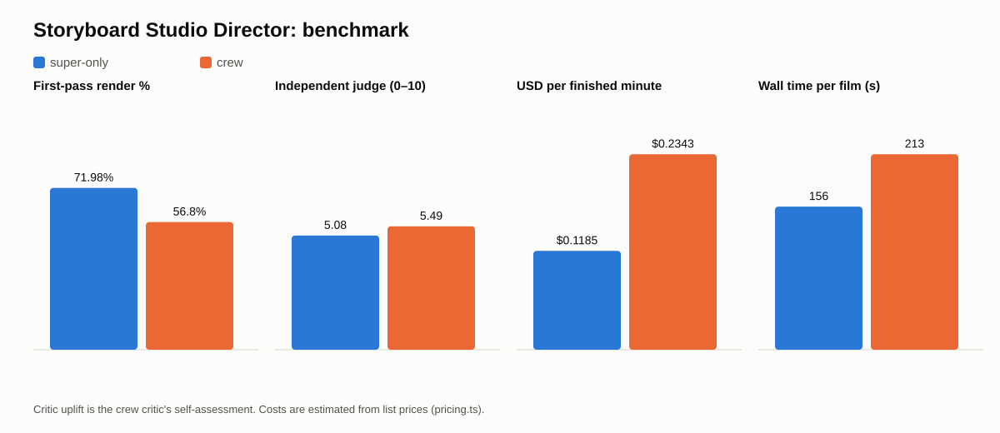

# Director benchmark: results

Generated 2026-09-26T03:56:29.870Z against `http://localhost:3100` · provider **nemotron** · 20 runs · raw data: [eval/runs.csv](eval/runs.csv), [eval/runs.jsonl](eval/runs.jsonl).

Configs: **super-only** = every role on Nemotron Super, no critic · **crew** = Ultra plans, Super draws, Nano critiques in text mode (≤ 2 revisions; no Nemotron vision model is served, DECISIONS D15), Nano edits · **crew+tavily** = crew plus Tavily references.

**Independent judge**: `google/gemma-3-27b-it` (a vision model on Token Factory, not part of the crew) scores every final frame 0–10 against its shot description, blind to the config.

| Config | Runs (done) | Judge score (0–10) | First-pass render % | Repairs / shot | Critic before → after | Lint left | Wall s | Tokens / run | USD total | USD / finished min |
|---|---|---|---|---|---|---|---|---|---|---|
| super-only | 10 (10) | 5.08 | 71.98 | 0.5 | — → — | 0.1 | 155.7 | 67,191 | $0.478 | $0.118 |
| crew | 10 (10) | 5.49 | 56.8 | 1.53 | 6.92 → 7.07 | 0.1 | 212.68 | 124,066 | $0.864 | $0.234 |

## Paired by prompt (independent judge)

Crew − super-only on the same prompt: mean **+0.41**; the crew is better on **6**, worse on **2**, and ties (±0.25) on **2** of 10 prompts. Cost ratio: **1.81×**.

| Prompt | Judge super-only | Judge crew | Δ | USD super-only | USD crew |
|---|---|---|---|---|---|
| en-lighthouse | 4.6 | 5.6 | +1 | $0.0650 | $0.1251 |
| en-robot-garden | 6.83 | 6.67 | -0.16 | $0.0779 | $0.2288 |
| en-paper-boat | 4.75 | 4 | -0.75 | $0.0391 | $0.0520 |
| en-moon-bakery | 3.86 | 5.25 | +1.39 | $0.0513 | $0.0815 |
| vi-ao-dai | 5.17 | 5.83 | +0.66 | $0.0411 | $0.0448 |
| vi-trau-vang | 5.2 | 7 | +1.8 | $0.0381 | $0.0455 |
| vi-cho-noi | 4.17 | 4.71 | +0.54 | $0.0529 | $0.0591 |
| ja-umbrella | 7.25 | 5.5 | -1.75 | $0.0273 | $0.0380 |
| ja-tanuki | 5 | 4.83 | -0.17 | $0.0391 | $0.0698 |
| ja-sakura | 4 | 5.5 | +1.5 | $0.0457 | $0.1191 |

## Reading the results (honest)

- **The crew makes better films, modestly.** Blind to config, the judge prefers the crew on 6 of 10 prompts (mean +0.41 / 10) and prefers Super-only on 2. That is a small effect from 10 prompts, one run each and one judge model. Read it as "the crew helps", not as a precise number.
- **It costs about 1.8× more and takes longer.** Ultra's plans are more ambitious (more close-ups, more cast per shot), so the first-pass render rate is lower (57 % vs 72 %) and repairs per shot are higher. The critic's own revisions add only +0.15 on its self-score. The judge gain comes mostly from better plans and the extra repairs. A finished minute of film costs **$0.12 (Super-only) vs $0.23 (crew)** at our price table.
- **Both configs share the engine's measured gates** (D17–D25), which run on every drawing regardless of config. So this compares *who plans, critiques and edits*, not "gates vs no gates". Before the gates and kits existed, drawn people fell apart and heads were cut off (evidence: `evidence/showcase-v1/`, `evidence/bench-*-pregate*.jsonl`).
- **Not run:** config C (crew + Tavily) needs a `TAVILY_API_KEY` (BLOCKERS B2). The researcher is tested against a fake server only.
- Where: all 20 runs used the same commit on a local `next start` with the real Nemotron models on Token Factory. Long SSE streams from the build sandbox to the hosted demo were cut by the sandbox's egress tunnel (see STATUS "Where things ran"). The hosted demo made the tea-house showcase film.

## Per run

| Config | Prompt | Status | Shots | Judge | First-pass % | Repairs/shot | Critic | Lint | Wall s | USD |
|---|---|---|---|---|---|---|---|---|---|---|
| super-only | en-lighthouse | done | 5/5 | 4.6 | 60 | 1 | — → — | 0 | 223.25 | $0.0650 |
| crew | en-lighthouse | done | 5/5 | 5.6 | 40 | 3.6 | 5 → 5 (text) | 0 | 253.91 | $0.1251 |
| super-only | en-robot-garden | done | 6/6 | 6.83 | 50 | 1.5 | — → — | 0 | 229.32 | $0.0779 |
| crew | en-robot-garden | done | 6/6 | 6.67 | 0 | 7 | 3.33 → 3.83 (text) | 0 | 484.53 | $0.2288 |
| super-only | en-paper-boat | done | 4/4 | 4.75 | 75 | 0.5 | — → — | 0 | 150.39 | $0.0391 |
| crew | en-paper-boat | done | 4/4 | 4 | 75 | 0.75 | 7.75 → 7.75 (text) | 0 | 152.01 | $0.0520 |
| super-only | en-moon-bakery | done | 7/7 | 3.86 | 71.43 | 0.29 | — → — | 0 | 151.71 | $0.0513 |
| crew | en-moon-bakery | done | 8/8 | 5.25 | 62.5 | 0.75 | 7.5 → 7.75 (text) | 0 | 190.91 | $0.0815 |
| super-only | vi-ao-dai | done | 6/6 | 5.17 | 83.33 | 0.17 | — → — | 0 | 127.58 | $0.0411 |
| crew | vi-ao-dai | done | 6/6 | 5.83 | 83.33 | 0.33 | 7.67 → 7.83 (text) | 0 | 141.13 | $0.0448 |
| super-only | vi-trau-vang | done | 5/5 | 5.2 | 80 | 0.2 | — → — | 0 | 136.17 | $0.0381 |
| crew | vi-trau-vang | done | 5/5 | 7 | 100 | 0 | 7 → 7.6 (text) | 0 | 121.69 | $0.0455 |
| super-only | vi-cho-noi | done | 6/6 | 4.17 | 66.67 | 0.67 | — → — | 0 | 159.17 | $0.0529 |
| crew | vi-cho-noi | done | 7/7 | 4.71 | 57.14 | 0.43 | 7.86 → 7.86 (text) | 0 | 177.64 | $0.0591 |
| super-only | ja-umbrella | done | 4/4 | 7.25 | 100 | 0 | — → — | 1 | 103.35 | $0.0273 |
| crew | ja-umbrella | done | 4/4 | 5.5 | 100 | 0 | 7.75 → 7.75 (text) | 0 | 132.25 | $0.0380 |
| super-only | ja-tanuki | done | 6/6 | 5 | 33.33 | 0.67 | — → — | 0 | 109.16 | $0.0391 |
| crew | ja-tanuki | done | 6/6 | 4.83 | 16.67 | 1 | 7.83 → 7.83 (text) | 0 | 177.3 | $0.0698 |
| super-only | ja-sakura | done | 8/8 | 4 | 100 | 0 | — → — | 0 | 166.92 | $0.0457 |
| crew | ja-sakura | done | 8/9 | 5.5 | 33.33 | 1.44 | 7.5 → 7.5 (text) | 1 | 295.42 | $0.1191 |

Notes: critic scores come from the crew's own critic, so they measure self-assessed uplift; the judge column is the independent rating (one VLM, so read it as a relative signal between configs, not an absolute quality grade). Judge calls are billed in the ledger but excluded from the per-run USD. A revision replaces a shot only when it scores higher (DECISIONS D11). USD uses the price table in `src/lib/providers/pricing.ts`, which should be reconciled with the Token Factory billing page.
