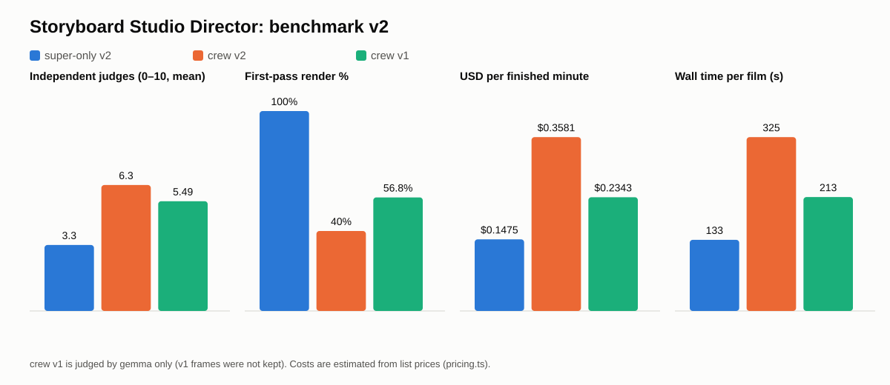

# Director benchmark v2: results

Generated 2026-10-10T05:30:18.682Z against `https://studio-production-049c.up.railway.app` · provider **nemotron** · 2 v2 runs · raw data: [eval/v2/runs.csv](eval/v2/runs.csv), [eval/v2/runs.jsonl](eval/v2/runs.jsonl). v1 results: [EVAL_RESULTS_V1.md](EVAL_RESULTS_V1.md).

Same 10 prompts and the same judge prompt as v1. Configs: **super-only v2** = every role on Nemotron Super, no critic · **crew v2** = Ultra plans, Super draws, the hybrid critic (a VLM looks, Nemotron Nano scores, D33) with the floor, Nano edits · **crew v2+tavily** = crew v2 plus research (only when the server has a Tavily key) · **crew v1** = the v1 rows, reused, not re-run (judged by gemma only).

**Independent judges** (blind to config, both different from the critic and from every crew model, checked per run): `google/gemma-3-27b-it` and `moonshotai/Kimi-K3`. Each scores every final frame 0–10 against its shot description. "Judge" is the mean of the two. **Critic uplift** is judged independently too: for every shot where a revision replaced the first version, both judges score the pre-revision snapshot and the accepted one, and the uplift is the mean (after − before).

## Targets (SPEC v2 WP7)

| Target | Goal | Measured | |
|---|---|---|---|
| Judge mean, crew v2 (mean of both judges) | ≥ 6.5 | 6.3 | ❌ missed |
| Crew v2 wins vs super-only v2 (paired, ±0.25 = tie) | ≥ 8/10 | 1/1 | ❌ missed |
| Critic uplift, independently judged | ≥ +0.5 | +1 | ✅ met |
| USD per finished minute, crew v2 | ≤ $0.40 | $0.358 | ✅ met |

## By config

| Config | Runs (done) | Judge (mean) |  Judge gemma-3-27b-it | Judge Kimi-K3 | First-pass % | Repairs / shot | Critic self-score | Uplift (judged) [shots] | Gate failures | Below floor | Wall s | Tokens / run | USD total | USD / finished min |
|---|---|---|---|---|---|---|---|---|---|---|---|---|---|---|
| super-only v2 | 1 (1) | 3.3 |  4.8 | 1.8 | 100 | 0 | — | — [0] | 0 | 0 | 132.8 | 56,094 | $0.038 | $0.147 |
| crew v2 | 1 (1) | 6.3 |  7 | 5.6 | 40 | 2 | 4.8 → 6 | +1 [3] | 0 | 3 | 324.58 | 166,506 | $0.110 | $0.358 |
| crew v1 | 10 (10) | 5.49 |  5.49 | — | 56.8 | 1.53 | 6.92 → 7.07 | — [0] | 0 | 0 | 212.68 | 124,066 | $0.864 | $0.234 |

## Paired: crew v2 vs super-only v2 (mean of both judges)

crew v2 − super-only v2 on the same prompt: mean **+3**; crew v2 is better on **1**, worse on **0**, and ties (±0.25) on **0** of 1 prompts. 

| Prompt | super-only v2 | crew v2 | Δ |
|---|---|---|---|
| en-lighthouse | 3.3 | 6.3 | +3 |

## Paired: crew v2 vs crew v1 (judge gemma-3-27b-it only, as in v1)

crew v2 − crew v1 on the same prompt: mean **+1.4**; crew v2 is better on **1**, worse on **0**, and ties (±0.25) on **0** of 1 prompts. Same prompts, same judge, same judge prompt; v1 frames were not kept, so the second judge can't score v1.

| Prompt | crew v1 | crew v2 | Δ |
|---|---|---|---|
| en-lighthouse | 5.6 | 7 | +1.4 |

## Per run

| Version | Config | Prompt | Status | Shots | Judge |  Judge gemma-3-27b-it | Judge Kimi-K3 | First-pass % | Repairs/shot | Critic self | Uplift [shots] | Gates | Wall s | USD |
|---|---|---|---|---|---|---|---|---|---|---|---|---|---|---|
| v2 | super-only v2 | en-lighthouse | done | 5/5 | 3.3 |  4.8 | 1.8 | 100 | 0 | — → — | — [0] | 0 | 132.8 | $0.0381 |
| v2 | crew v2 | en-lighthouse | done | 5/5 | 6.3 |  7 | 5.6 | 40 | 2 | 4.8 → 6 | +1 [3] | 0 | 324.58 | $0.1104 |
| v1 | crew v1 | en-lighthouse | done | 5/5 | 5.6 |  5.6 | — | 40 | 3.6 | 5 → 5 | — [0] | 0 | 253.91 | $0.1251 |
| v1 | crew v1 | en-robot-garden | done | 6/6 | 6.67 |  6.67 | — | 0 | 7 | 3.33 → 3.83 | — [0] | 0 | 484.53 | $0.2288 |
| v1 | crew v1 | en-paper-boat | done | 4/4 | 4 |  4 | — | 75 | 0.75 | 7.75 → 7.75 | — [0] | 0 | 152.01 | $0.0520 |
| v1 | crew v1 | en-moon-bakery | done | 8/8 | 5.25 |  5.25 | — | 62.5 | 0.75 | 7.5 → 7.75 | — [0] | 0 | 190.91 | $0.0815 |
| v1 | crew v1 | vi-ao-dai | done | 6/6 | 5.83 |  5.83 | — | 83.33 | 0.33 | 7.67 → 7.83 | — [0] | 0 | 141.13 | $0.0448 |
| v1 | crew v1 | vi-trau-vang | done | 5/5 | 7 |  7 | — | 100 | 0 | 7 → 7.6 | — [0] | 0 | 121.69 | $0.0455 |
| v1 | crew v1 | vi-cho-noi | done | 7/7 | 4.71 |  4.71 | — | 57.14 | 0.43 | 7.86 → 7.86 | — [0] | 0 | 177.64 | $0.0591 |
| v1 | crew v1 | ja-umbrella | done | 4/4 | 5.5 |  5.5 | — | 100 | 0 | 7.75 → 7.75 | — [0] | 0 | 132.25 | $0.0380 |
| v1 | crew v1 | ja-tanuki | done | 6/6 | 4.83 |  4.83 | — | 16.67 | 1 | 7.83 → 7.83 | — [0] | 0 | 177.3 | $0.0698 |
| v1 | crew v1 | ja-sakura | done | 8/9 | 5.5 |  5.5 | — | 33.33 | 1.44 | 7.5 → 7.5 | — [0] | 0 | 295.42 | $0.1191 |

## Reading the results (honest)

_To be written by a person after the run, from the numbers above only. If a target is missed, say so; the prompts were not tuned on._

Notes: judge calls are billed in the spend ledger but excluded from the per-run USD. USD uses the price table in `src/lib/providers/pricing.ts`. One run per prompt and config, so read small differences as noise.
