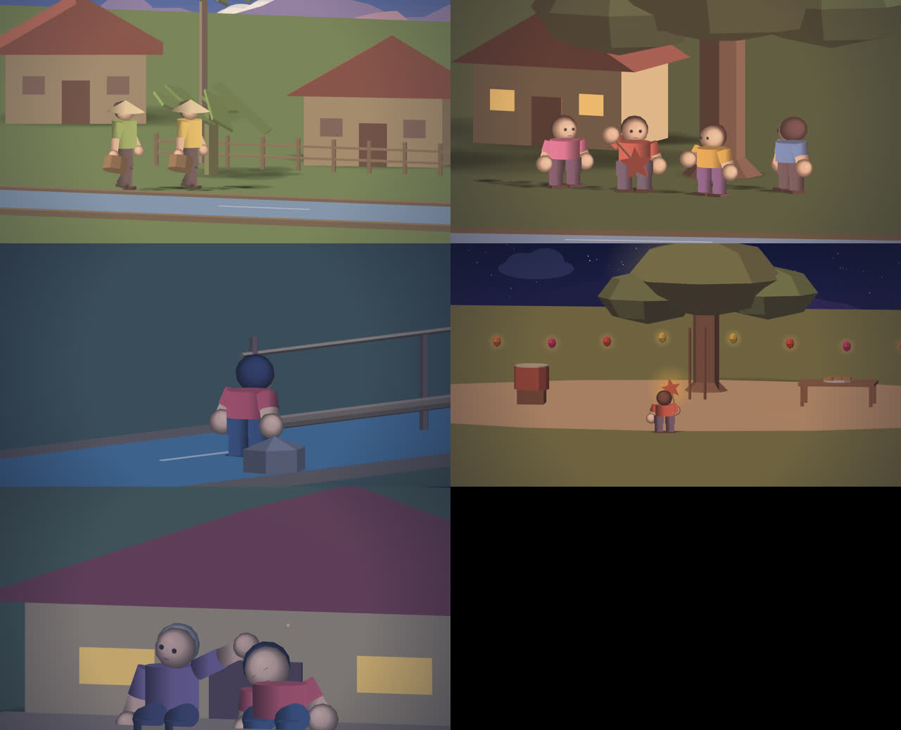

# Đèn Ông Sao · The Star Lantern

*A 20-minute 3D animated short made entirely with this engine — written, staged,
animated, voiced, scored, edited and mastered through the app's own API. No
hand-drawn frames, no API keys; the screenplay → spec step is deterministic.*

> Ngày xửa ngày xưa, ở một ngôi làng nhỏ bên dòng sông, mỗi mùa trăng rằm
> tháng Tám, trẻ con lại rước đèn…

On the eve of the Mid-Autumn festival, Bà makes her grandson Tí a star lantern.
That evening the river wind tears it from his hand and carries it away. A
firefly leads him through the night — across the rice fields, into the bamboo
forest, over a monkey bridge, past a sleeping buffalo — to the lotus pond where
the lantern lies torn on a rock. The fireflies gather and light it for him, and
from the hilltop he watches the whole village light up for the festival.

<p align="center"></p>

[▶ trailer](../../docs/media/den-ong-sao-trailer.mp4) · [contact sheet — one frame every 40 s](../../docs/media/den-ong-sao-contact-sheet.jpg)

| | |
|---|---|
| Running time | **20:14.5** · 105 shots · 7 chapters · 29,148 frames at 24 fps |
| Picture | DCI Flat 1.85:1 · 1998×1080 · 24 fps (animation at 12 fps) |
| Sound | narration + dialogue (local espeak-ng TTS, lip-synced) · original score · mix measured **−16.2 LUFS**, loudness range 8.9 LU, no silence ≥ 5 s · −24 LUFS in the DCP |
| Deliverables | `film.mp4` · SMPTE DCP · EDL/OTIO · subtitles · glTF per shot |

## Production record (this run)

- 105 `PUT /api/frames/:id/motion` calls rendered **15,108 frames at 2K in 69.5 min** on 4 CPU cores (~276 ms/frame including TTS and writes; synchronous API, one shot at a time); 4.5 GB of PNG clips.
- `GET /api/projects/:id/lint`: **0 errors**, 1 warning (a 180°-line cross in the festival).
- Export ZIP 4.8 GB → `assemble.sh` → `film.mp4` (H.264 1998×1080 + AAC 48 kHz, 125 MB) in 19 min.
- `npm run master:dcp … --mbps 80` → SMPTE DCP **`DenOngSao_SHR_F_VI-XX_VN_51_2K_SBS_20260924_SBS_SMPTE_OV`** in 2 h 12 min (≈ 3.6 frames/s J2K on 4 cores): picture MXF 12.1 GB (29,148 J2K frames, max 416,677 bytes = 32 % of the DCI per-frame cap, Rsiz = CINEMA2K), sound MXF 1.05 GB (5.1 PCM 24-bit, mix brought from −16.2 to −24.0 LUFS).
- DCP validation: **ClairMeta — 78 checks, Success**; asdcplib `asdcp-info` reads both MXFs as SMPTE 429 (29,148 edit units each) and `asdcp-unwrap` extracts frames that ffmpeg decodes (below); CPL / PKL / ASSETMAP validate against the SMPTE 429-7 / 429-8 / 429-9 XSDs; the PKL SHA-1 of every asset matches the file on disk.
- Three real limits surfaced by making a feature-length film, all fixed with regression tests: a dissolve after a hard cut broke the ffmpeg graph (concat/xfade timebase), the export silently skipped the mix for films over 15 minutes, and `-cinema2K` always spends the full 250 Mbit/s (~24 GB of picture for 20 minutes) — hence `--mbps`.

<p align="center"><br><sub>Frames 1200, 7000, 14000, 21000, 27500 unwrapped from the picture MXF by asdcplib and decoded by ffmpeg's X′Y′Z′ decoder.</sub></p>

## Chapters

1. **Làng ven sông** — the village at dawn, fishing, making the lantern, the dragon game
2. **Cơn gió chiều** — the legend of Chú Cuội, the gust, the lantern lost in the river
3. **Đom đóm** — the firefly, the night fields, the owl, the forest lights up
4. **Cầu khỉ** — the monkey bridge, the buffalo, the lotus pond
5. **Ánh trăng** — the fireflies light the lantern, the hilltop, the village lights, farewell
6. **Đêm hội trăng rằm** — lion dance, the lantern parade, reunion, mooncakes, floating lanterns
7. **Trăng** — the porch under the full moon; credits

## Reproduce it

```bash
npm run build && npx next start -p 3000          # the app, as any agent would run it
npx tsx examples/film/produce.ts                  # ~1 h on 4 cores: every shot through the API
npm run master:dcp -- <unzipped-export> --out DCP --title "Đèn Ông Sao" --kind short --lang VI-XX --mbps 80
```

`produce.ts` drives only public endpoints: `POST /api/projects` → `POST
/api/script/import` → per shot `PATCH /api/frames/:id` (scene, transition),
`PUT …/dialogue` (TTS), `PUT …/motion` (renders the clip) → `PUT
/api/projects/:id/soundtrack` → `GET …/lint` → `GET /api/export/zip` →
`sh assemble.sh`. It is resumable (a content hash per shot), so editing one
shot re-renders only that shot.

## How it is built

| File | What it is |
|---|---|
| `kit.ts` | Colour script (dawn / day / dusk / night / festival), sky backdrops whose mountains sit on the exact projected horizon, low-poly set pieces, the cast (hair, nón lá, the star lantern held via solid `attach`), exact framing helpers on the engine's own projection |
| `sets.ts` | Ten locations as pure functions of the palette, with staging marks; buffalo, owl, lion-dance lion, drum, mooncakes, lantern strings |
| `shots.ts` | The shot grammar: a compact shot → a validated motion spec. Camera moves are sampled so the subject stays locked on screen; tracking shots read the walker's position back from the engine's evaluator; blinks, breathing, lip-sync are added automatically |
| `ch1.ts` … `ch7.ts`, `extras.ts` | The screenplay, shot by shot |
| `acting.ts` | Gestures (wave, hop, sit, hold the lantern), firefly swarms, props |
| `score.ts` | The original score: a deterministic pentatonic synthesizer (plucked zither, bamboo flute, pads, lion-dance drums, crickets, room reverb), one 8-bar main theme quoted across the film |
| `produce.ts` | The producer (above) · `qa.ts` / `frame.ts` — fast visual QA through the same compile → sanitize → rasterize path |

`tests/film.test.ts` keeps the film honest: every shot must stay a valid spec
that compiles, the cut must stay ≥ 20 minutes on the project's own timeline,
and the build and the score must stay deterministic.

## Honest notes

- The look is deliberately a low-poly storybook: flat-shaded 3D with a
  quantized light, gradient skies, glow for lanterns and fireflies. The camera
  is orthographic (no perspective foreshortening).
- Voices are espeak-ng — intelligible, robotic. The film is mostly wordless
  (like *Flow*) so the story does not lean on them; a production would drop
  recorded WAVs into the same `PUT …/dialogue` call.
- The score is composed and mixed by algorithm and measurement (per-mood
  loudness, limiter, reverb), not by a musician's ear.
- For a painterly or photoreal look, every shot also exports as glTF (Blender)
  and as depth / segmentation / OpenPose passes (AI video restyling) from the
  same geometry and camera.
